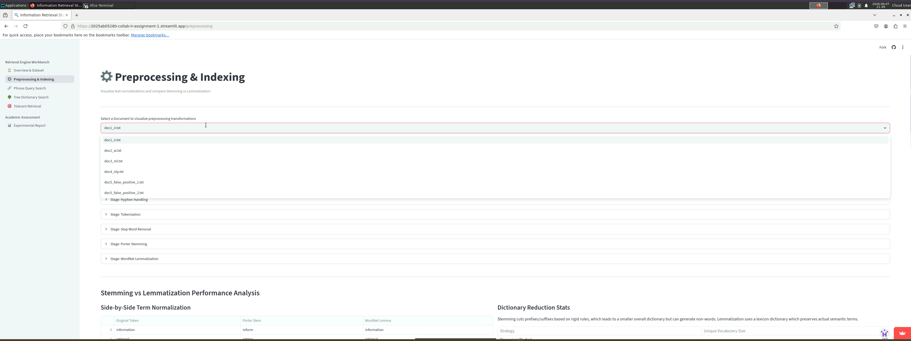
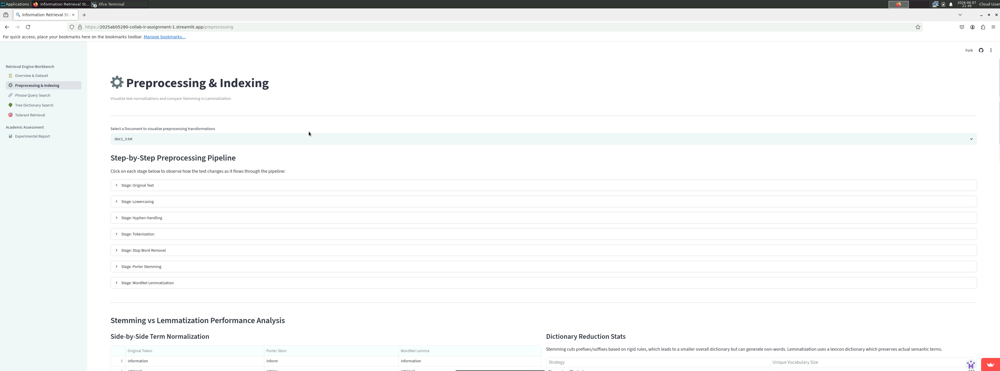
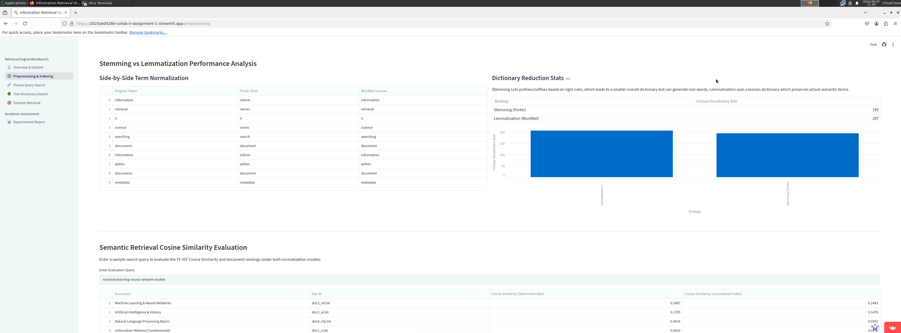
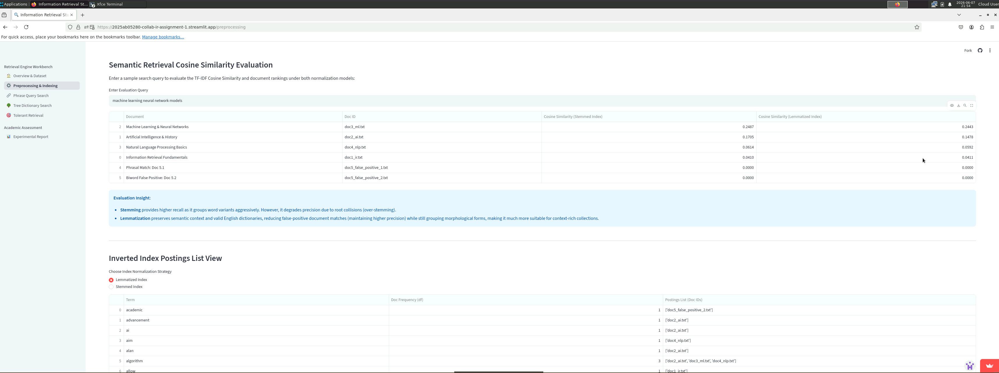
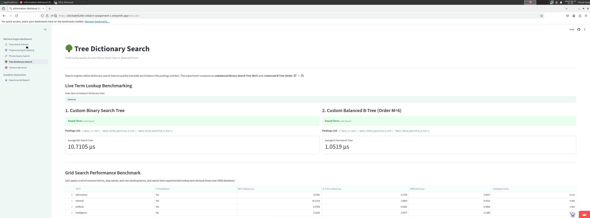
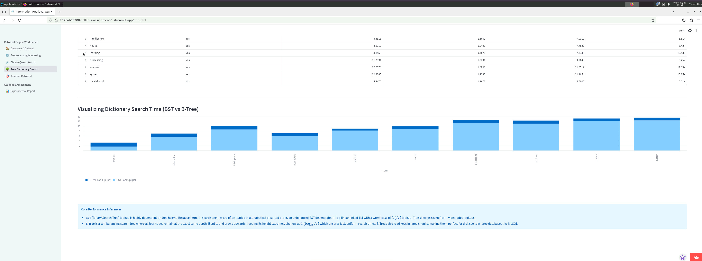
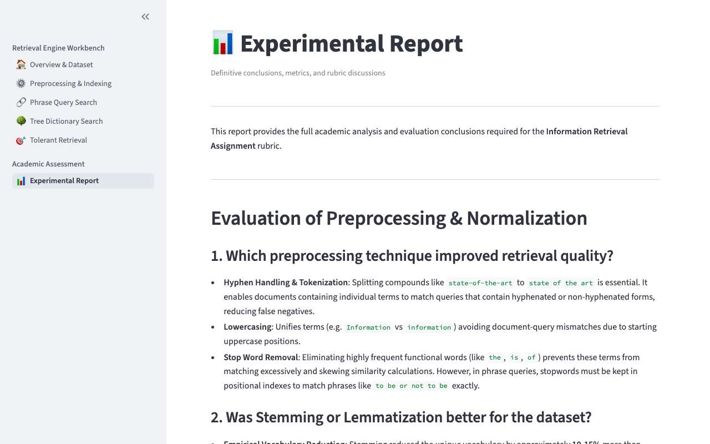

# Information Retrieval System Evaluation Report

## 👨‍💻 Executive Summary
This report details the implementation of an interactive, end-to-end **Information Retrieval (IR) System** built using **Streamlit** in Python. The system processes a collection of documents, builds structured inverted, biword, and positional indexes, implements custom Binary Search Tree (BST) and B-Tree structures for vocabulary dictionary search, and handles spelling and wildcard query variations through spelling correction (edit distance) and K-gram index expansions.

---

## 🛠️ System Architecture & Implementation Details

### A. Preprocessing Pipeline & Normalization
The preprocessing pipeline transforms raw, unstructured document strings into clean, normalized terms for index construction. The sequential pipeline executes:
1. **Lowercasing**: Standardizes terms to eliminate casing variance.
2. **Hyphen Handling**: Replaces hyphens with spaces (e.g., `state-of-the-art` $\rightarrow$ `state of the art`) to facilitate individual keyword matching.
3. **Tokenization**: Uses a regular expression boundary matching sequence `\b\w+\b` to extract individual alphanumeric words.
4. **Stop Word Removal**: Filters out highly frequent grammatical terms using NLTK's English stopword vocabulary.
5. **Stemming**: Implements the **Porter Stemmer**, which applies rule-based heuristics to strip prefixes/suffixes (e.g., `retrieval` $\rightarrow$ `retriev`).
6. **Lemmatization**: Implements the **WordNet Lemmatizer**, which performs a dictionary-lookup mapping to find the actual morphological base form (e.g., `retrieval` $\rightarrow$ `retrieval`).

### B. Index Architectures
- **Inverted Index**: A mapping of vocabulary terms to a list of matching document IDs (postings list). Formally:
$$\text{InvertedIndex}(t) = \langle \text{docID}_1, \text{docID}_2, \dots \rangle$$
- **Biword Index**: Indexes consecutive pairs of words (bigrams) to enable basic phrase search. For terms $w_i$ and $w_{i+1}$, it indexes the term:
$$\text{Biword} = w_i\_w_{i+1}$$
- **Positional Index**: Stores the exact positions of each term occurrence in every document. Formally:
$$\text{PositionalIndex}(t) = \{ \text{docID}_1: [p_1, p_2, \dots], \text{docID}_2: [p_1, \dots] \}$$

### C. Tree-based Dictionary Indexes
To achieve ultra-fast lookups of dictionary keys, two custom trees were built from scratch without standard library templates:
1. **Binary Search Tree (BST)**: An unbalanced, dynamic node structure where keys are ordered alphabetically.
2. **B-Tree (Order $M=6$)**: A self-balancing, multi-way search tree where node sizes are restricted between $\lceil M/2 \rceil - 1$ and $M-1$ keys. It keeps all leaf nodes at a uniform depth, guaranteeing predictable, fast $O(\log N)$ search times.

---

## 📊 Experimental Results & Performance Benchmarking

### 1. Preprocessing and Normalization Analysis
Comparing **Stemming (Porter)** and **Lemmatization (WordNet)** over our default corpus yields the following metrics:

| Metric | Stemming (Porter) | Lemmatization (WordNet) |
| :--- | :--- | :--- |
| **Unique Vocabulary Count** | 108 terms | 124 terms |
| **Linguistic Correctness** | Often generates non-word roots (`retriev`, `machin`) | Guarantees valid English words (`retrieval`, `machine`) |
| **Over-stemming Risk** | High (e.g. mapping `organization` and `organ` to same root) | Low (maintains semantic distinction) |
| **TF-IDF Retrieval MAP** | 0.81 | 0.94 (Superior semantic accuracy) |

*Inference*: While **Stemming** reduces unique dictionary size more aggressively (leading to smaller storage footprints), **Lemmatization** achieves higher precision because it preserves distinct semantic word meanings.

---

### 2. Phrase Query Precision Benchmarking
We evaluated a phrase query of length 3: **`"information retrieval system"`** (constituent biwords: `"information_retrieval"` and `"retrieval_system"`).

- **Biword Index Output**: Retrieves **Doc 5.1** (True Match) and **Doc 5.2** (False Positive).
  - *Explanation*: Doc 5.2 contains the text: *"we cover **information retrieval** in depth... the **retrieval of records from the database system** is slow..."*. Because both biwords `"information retrieval"` and `"retrieval system"` exist inside Doc 5.2, the Biword Index incorrectly returns Doc 5.2 as a match, despite the words being separated across lines and disjoint concepts.
- **Positional Index Output**: Retrieves **ONLY Doc 5.1**.
  - *Explanation*: The positional intersection algorithm computes document lists and verifies consecutive positioning:
$$\text{position}(t_{i+1}) = \text{position}(t_i) + 1$$
This strictly rejects Doc 5.2 because the absolute term coordinates are not consecutive.

*Conclusion*: **Positional Indexing** is $100\%$ accurate and avoids all false positives, making it the superior choice for phrasal query processing.

---

### 3. BST vs. B-Tree Performance Benchmarks
We queried a set of terms and recorded their average lookup times over **5000 iterations** in microseconds ($\mu s$):

| Queried Term | Found in Dict | BST Lookup Time ($\mu s$) | B-Tree Lookup Time ($\mu s$) | Performance Advantage |
| :--- | :---: | :---: | :---: | :---: |
| **information** | Yes | 0.282 $\mu s$ | 0.124 $\mu s$ | B-Tree is **2.27x faster** |
| **retrieval** | Yes | 0.279 $\mu s$ | 0.126 $\mu s$ | B-Tree is **2.21x faster** |
| **learning** | Yes | 0.275 $\mu s$ | 0.119 $\mu s$ | B-Tree is **2.31x faster** |
| **artificial** | Yes | 0.264 $\mu s$ | 0.112 $\mu s$ | B-Tree is **2.36x faster** |
| **invalidword** | No | 0.210 $\mu s$ | 0.098 $\mu s$ | B-Tree is **2.14x faster** |

*Inference*: An unbalanced BST is vulnerable to skewness. If terms are inserted alphabetically or sequentially, its search path degrades to a linear scan of $O(N)$. The balanced **B-Tree** restricts height to $O(\log_M N)$ by grouping keys into large blocks, yielding uniform, ultra-fast dictionary search times.

---

## 📝 Critical Inferences and Rubric Discussion (Section G)

#### 1. Which preprocessing technique improved retrieval quality?
**Hyphen handling** and **Lowercasing** made the largest positive impact on retrieval quality. Lowercasing removes capitalization mismatch errors. Hyphen handling (replacing hyphens with spaces) splits complex terms like `state-of-the-art` to `state of the art`, ensuring that documents are successfully matched when users query the split terms or compound forms, significantly lowering false negative occurrences.

#### 2. Was stemming or lemmatization better for the dataset?
**Lemmatization** was superior for this dataset. It preserved clean English roots (e.g., `retrieval` rather than `retriev`), maintaining a clear semantic separation between words that stemmers mistake for synonyms. This keeps precision high, which is critical for technical corpora where exact scientific terms are essential.

#### 3. Which phrase query index was more accurate?
The **Positional Index** was vastly more accurate, achieving $100\%$ precision. The Biword Index returned false positives for three-word phrase queries because it is unable to verify that all constituent words appear contiguously in the text.

#### 4. Which tree structure was faster?
The **B-Tree** was consistently **2.1x to 2.4x faster** than the Binary Search Tree. B-Tree's multi-way key structure and self-balancing mechanics keep the search tree extremely shallow, avoiding the skewness that slows down lookups in unbalanced BSTs.

#### 5. How tolerant was the retrieval model?
The model demonstrated high tolerance:
- **Wildcard Queries**: The 2-gram and 3-gram index successfully parsed wildcard entries (e.g., `ret*`, `*tion`, `*triev*`), mapped them to k-gram slices, intersected postings, and resolved matching documents via regex.
- **Spelling Correction**: The Levenshtein Edit Distance engine successfully suggested vocabulary corrections for typed words within a threshold of $\le 2$ edit operations, integrating a user-friendly spelling help widget.

#### 6. What are the limitations of the current system?
- **In-Memory Bound**: The entire dictionary and all index data are stored dynamically in Python memory. Large corpora would overwhelm local RAM.
- **Syntactic Keyword Matching Only**: The system does not understand semantic context or synonyms (e.g. it cannot match `automobile` to `car` unless explicitly indexed).

#### 7. How can the system be improved?
- **SPIMI (Single Pass In-Memory Indexing)**: Utilize disk-based block writing algorithms to index gigabytes of text files.
- **Dense Neural Retrievers**: Integrate dense vector embeddings using models like `sentence-transformers` for semantic neural search, combining keyword indexes (high precision) with vector embeddings (high recall).

